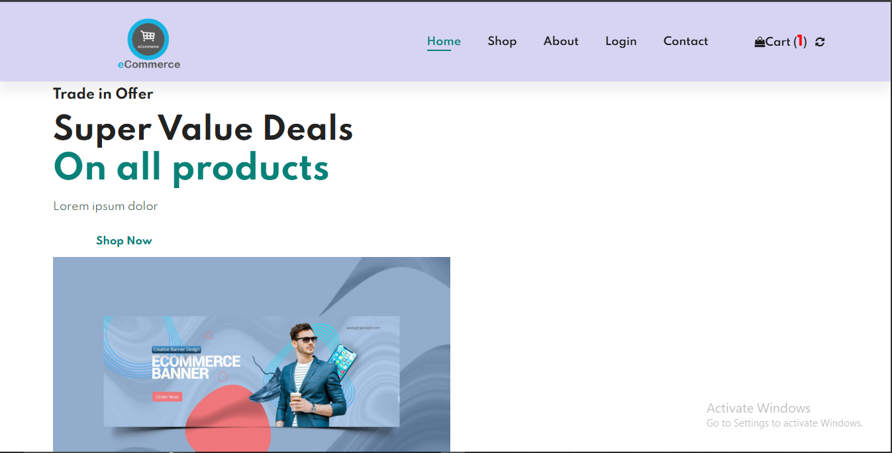
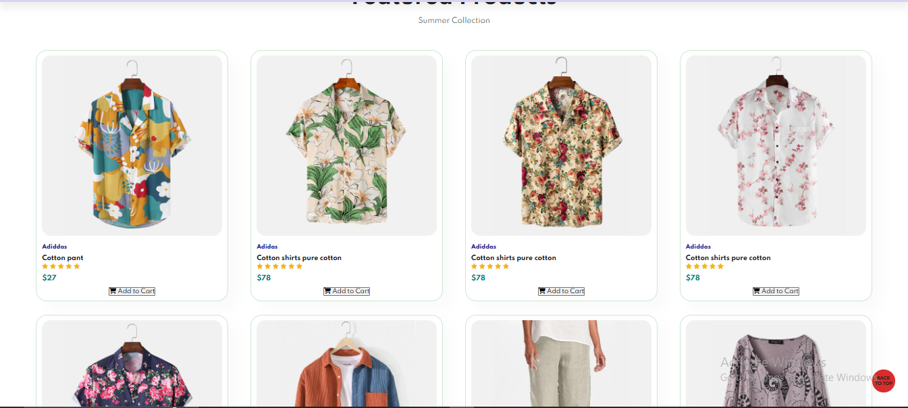
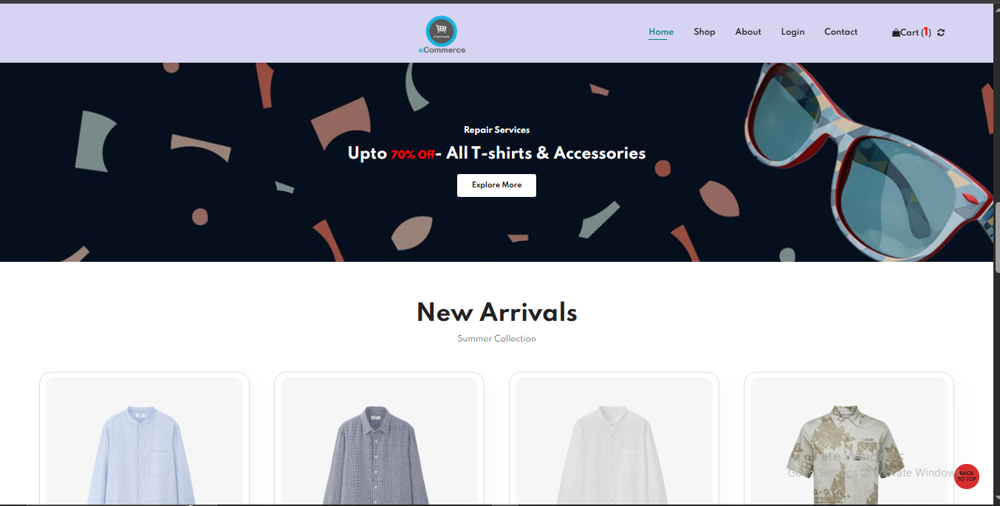
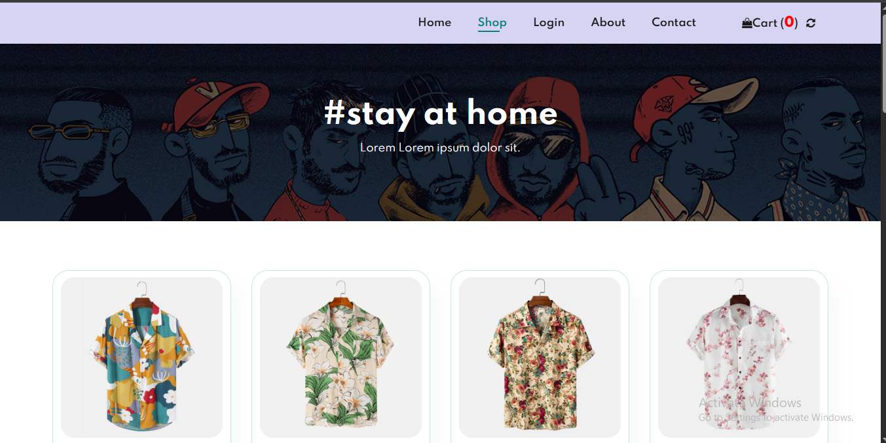
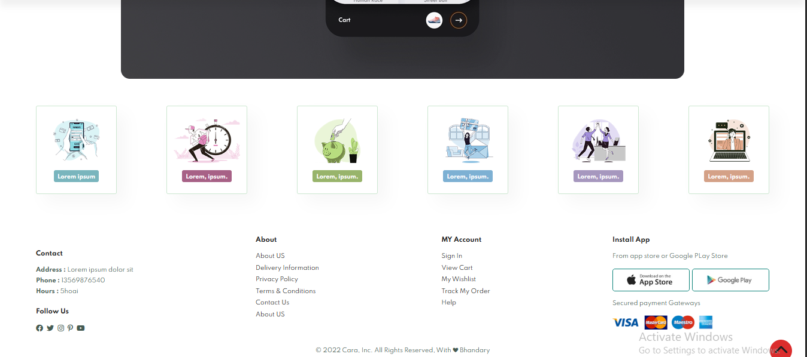

# 🛒 E-Commerce Website – CARA

Welcome to **CARA**, a responsive and modern e-commerce website built with HTML, CSS, and JavaScript.  
This project showcases a fully functional frontend design of a shopping website, complete with product views, cart system, login page, and responsive layout.

---

## 🚀 Features

- 🏠 Homepage with featured banners
- 🛍️ Product listing with filters
- 📄 Product detail pages
- 🛒 Cart system
- 👤 Login page
- 📞 Contact page
- 📱 Fully responsive layout
- 🎨 Modular CSS with separate components like `header.css`, `footer.css`, etc.

---

## 📸 Screenshots

> Explore the UI components of the website below:

### 🖼 Homepage


### 🛒 Product Page


### 📄 Product Detail Page


### 🛍 Cart View


### 👤 Login Page


---

## 🗂️ Project Structure

```plaintext
E-Commerce-Website/
├── index.html
├── about.html
├── shop.html
├── cart.html
├── sproduct.html
├── login.html
├── contact.html
├── css/
│   ├── style.css
│   ├── header.css
│   ├── footer.css
│   └── cart.css
├── js/
│   ├── cart.js
│   └── script.js
├── img/
├── website-Photos/
│   ├── web1.PNG
│   ├── web2.PNG
│   └── ...
└── README.md
